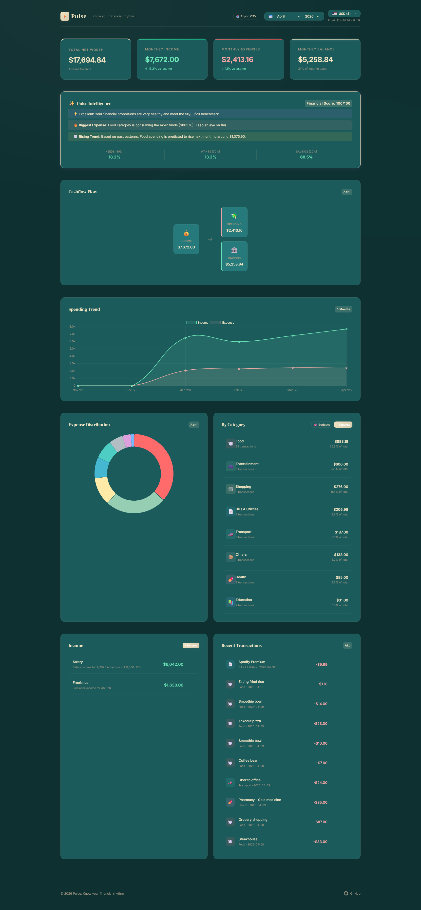
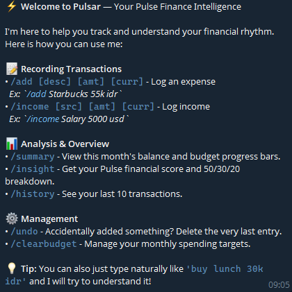
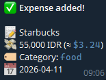
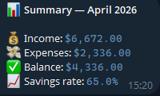
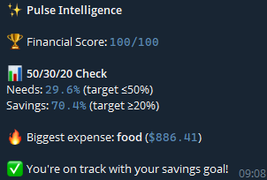

# Pulse - Personal Finance Intelligence

> *"Know your financial rhythm."*

Pulse is a proactive personal finance application that goes beyond passive tracking. It actively learns your spending patterns, detects anomalies, and forecasts future trends to give you complete control over your financial health.


---



---

## ⚡ Hosting & Free Tier Limitations

Pulse is designed to be highly interactive, especially with its **Telegram Bot (Pulsar)**. Running a bot 24/7 requires a continuous background process (polling).

> [!IMPORTANT]
> **Why Local Setup is Recommended:**
> Most free hosting providers (e.g., PythonAnywhere, Render, or Railway free tiers) often restrict long-running background tasks or outbound internet access, making it difficult to keep the Telegram bot alive 24/7 for free. 
> 
> For the best experience without costs, **running Pulse locally on your machine** or an always-on home server (like a Raspberry Pi) is the most reliable way to maintain your "financial rhythm."

---

## 🚀 Local Setup Guide

Follow these steps to get Pulse running on your own computer:

### 1. Prerequisites
- **Python 3.10+** installed.
- A **Telegram Bot Token** (Get it from [@BotFather](https://t.me/botfather)).

### 2. Installation
1.  **Clone the repository** to your local machine.
2.  **Install dependencies**:
    ```bash
    pip install -r requirements.txt
    ```

### 3. Environment Configuration
Create a file named `.env` in the root directory and add your credentials:
```env
TELEGRAM_BOT_TOKEN=your_token_here
TELEGRAM_CHAT_ID=your_personal_chat_id # Optional for auto-summaries
```

### 4. Database Initialization
Initialize the database and populate it with sample data:
```bash
python -c "from app import init_db; init_db()"
python seed.py
```

### 5. Running the Application
To have the full Pulse experience, you need to run **two** processes simultaneously:

**Terminal A: The Web Dashboard**
```bash
python app.py
```
*Access your dashboard at `http://127.0.0.1:5000`*

**Terminal B: The Telegram Bot**
```bash
python bot.py
```
*You can now chat with your bot to log expenses!*

---

## ✨ Key Features

- **Monthly Budgeting & Proactive Alerts**: Set month-specific spending targets for each category. Pulse keeps track and proactively warns you via Telegram when you reach 80% or 100% of your budget.
- **Multi-Currency Engine**: Full support for **USD ($)**, **EUR (€)**, and **IDR (Rp)**. All data is stored in a USD base for consistency.
- **Drafts Inbox (Telegram Text)**: A built-in staging area for incoming transactions. Send messages like `"Starbucks 25k idr"` to your bot and approve them in the dashboard.
- **6-Month Spending Trend**: High-fidelity visualization of your Income vs. Expense history.
- **Local Intelligence**: Natural language parsing that extracts amounts and categories automatically without external APIs.
- **Premium Aesthetic**: A bespoke "Teal Forest & Vanilla Latte" UI/UX designed for modern financial management.

---

## 🤖 Telegram Bot (Pulsar) Commands

- `/start` - Introduction and help.
- `/add [desc] [amount] [currency]` - Quick log (e.g., `/add coffee 5 usd`).
- `/summary` - Monthly financial overview with budget progress bars.
- `/history` - View the last 10 transactions.
- `/undo` - Remove the very last transaction added.
- `/setbudget [category] [amount] [currency]` - Set a monthly spending target.
- `/insight` - Real-time Pulse Intelligence report.
- `/clearbudget [category]` - Remove a specific budget. Call without arguments to see all active budgets.

### Bot Previews
| Start / Help | Add Expense | Summary | Intelligence |
| :---: | :---: | :---: | :---: |
|  |  |  |  |

---
*Created by Jsooonx for Portfolio | 2026*
