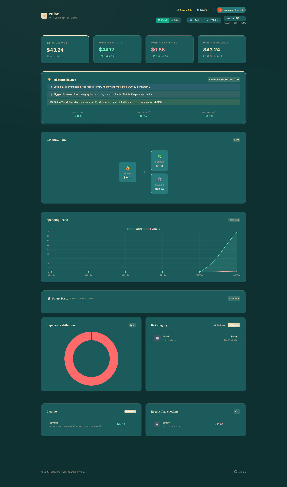

# Pulse - Personal Finance Intelligence

> *"Know your financial rhythm."*

Pulse is a proactive personal finance application that goes beyond passive tracking. It actively learns your spending patterns, detects anomalies, and forecasts future trends to give you complete control over your financial health.


**🌍 Live Demo:** [https://pulse-financialtracker.vercel.app/](https://pulse-financialtracker.vercel.app/)


---



---

## High-Craft Micro-interactions

Pulse features a bespoke animation system powered by **Anime.js**, designed to provide a premium, "Apple-inspired" tactile experience:

- **Metric Count-Up**: Financial figures animate smoothly from zero to their target value on page load.
- **Magnetic Grid**: Summary cards respond to your cursor with a subtle spring-based tilt and scale effect.
- **Staggered Entry**: All layout components, lists, and transaction items slide into view with a sequential, cinematic flow.
- **Cinematic Modals**: Ultra-smooth scaling and opacity transitions for all interaction dialogs.
- **Contextual Page Transitions**: Staggered exit animations when navigating between months or categories to prevent harsh "hard reloads."
- **Tactile Inputs**: Interactive focus states for form fields with subtle scaling and glow effects.

---

## Cloud-Synced Multi-User Architecture (New!)

Pulse now uses a sophisticated **Dual-Write Architecture** combining lightning-fast local SQLite storage with highly available **Supabase** cloud persistence.

- **Supabase Cloud Sync**: Every transaction logged (via Web or Telegram) is instantly mirrored to your personal Supabase table.
- **Telegram OAuth Linking**: Securely link your Telegram account to your Pulse Web account via a beautiful `/link-telegram` flow.
- **True Multi-User Support**: Multiple users can chat with the same Telegram bot (`@pulsar_finance_bot`), and the bot will intelligently route their data to their isolated cloud account and local cache.
- **Offline Resilience**: Bot responds instantly using local cache and syncs to Supabase seamlessly in the background.

### Production Infrastructure

Pulse is architected for maximum availability and zero-cost maintenance in a production environment:

- **Serverless Web Hosting (Vercel)**: The Flask dashboard is deployed as a Serverless Function, ensuring infinite scalability and free, high-performance hosting.
- **Bot Webhooks (Polling-Free)**: Unlike traditional polling bots, Pulse uses **Telegram Webhooks**. This allows the bot to run on the same serverless instance as the web app, responding instantly to incoming messages without requiring a 24/7 background process.
- **Ephemeral Storage with Cloud Rehydration**: The application uses `/tmp` for lightning-fast SQLite operations. Since serverless storage is ephemeral, Pulse automatically re-hydrates the local database from **Supabase** whenever the instance starts ("Cold Start"), ensuring 100% data persistence.
- **Uptime Keep-Alive**: To eliminate cold-start latency for the Telegram bot, the instance is kept "warm" via periodic pings from **UptimeRobot**, providing a near-instant response time 24/7.

---

## Local Setup Guide

Follow these steps to get Pulse running on your own computer:

### 1. Prerequisites
- **Python 3.10+** installed.
- A **Telegram Bot Token** (Get it from [@BotFather](https://t.me/botfather)).
- A **Supabase Account** with Auth and Database configured.

### 2. Installation
1.  **Clone the repository** to your local machine.
2.  **Install dependencies**:
    ```bash
    pip install -r requirements.txt
    ```

### 3. Environment Configuration
Create a file named `.env` in the root directory and add your credentials:
```env
TELEGRAM_BOT_TOKEN=your_token_here
SUPABASE_URL=your_supabase_project_url
SUPABASE_KEY=your_supabase_anon_key
SUPABASE_SERVICE_KEY=your_supabase_service_role_key
```

### 4. Database Initialization
Initialize the database. You can optionally populate it with sample data if you want to test the dashboard immediately:
```bash
python -c "from app import init_db; init_db()"
python seed.py  # Optional: Only run this if you want dummy data for testing
```

### 5. Running the Application
To have the full Pulse experience, you need to run **two** processes simultaneously:

**Terminal A: The Web Dashboard**
```bash
python app.py
```
*Access your dashboard at `http://127.0.0.1:5000`*

**Terminal B: The Telegram Bot**
```bash
python bot.py
```
*You can now chat with your bot to log expenses!*

---

## Premium Features

- **Apple-inspired "Digital Editorial" Aesthetic**: A bespoke Bento Grid layout featuring a "Teal Forest & Vanilla Latte" palette, designed for maximum clarity and high-end feel.
- **Pulse Intelligence**: A proactive layer that evaluates your finances against the **50/30/20 benchmark**, detects anomalies, and provides dynamic textual insights.
- **Cashflow Flow (Sankey)**: A high-fidelity visualization mapping your income sources directly to your expenses and savings.
- **Smart Paste (AI-Powered Stage)**: Paste raw bank emails or free-text messages directly into the dashboard. Pulse extracts amounts, dates, and categories with zero external API calls.
- **Recurring Manager**: Effortlessly automate monthly subscriptions, rent, or utilities.
- **Multi-Currency Engine**: Native support for **USD ($)**, **EUR (€)**, and **IDR (Rp)** with localized formatting and accurate internal conversion.
- **Professional Reporting**: Export beautifully styled **Excel (.xlsx)** reports with auto-formatting or clean **CSV** for data nerds.

---

## Telegram Bot (Pulsar) Commands

**Smart Tracker**
- `Beli kopi 50k` *(Automatically uses your default currency)*
- `Netflix subscription 15 USD` *(Overrides default currency)*

**Income & Budget**
- `/add_income 5000000 Salary` - Log a new income source.
- `/set_budget Food 2000000` - Set a monthly spending target.
- `/clear_budget Food` - Remove a category budget.

**Settings & Sync**
- `/currency` - Change your default currency (e.g., `/currency IDR`).
- `/undo` - Delete your very last expense from both Local DB and Supabase.
- `/undo_income` - Delete your very last income from both Local DB and Supabase.
- `/unlink` - Securely disconnect your Telegram account from Pulse.

**Insights**
- `/summary` - Monthly financial overview with budget progress bars.
- `/insight` - Real-time Pulse Intelligence report.
- `/history` - View the last 10 transactions.

---
*Created by Jsooonx for Portfolio | 2026*
